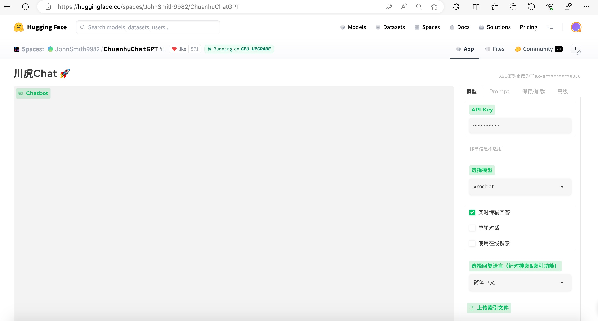
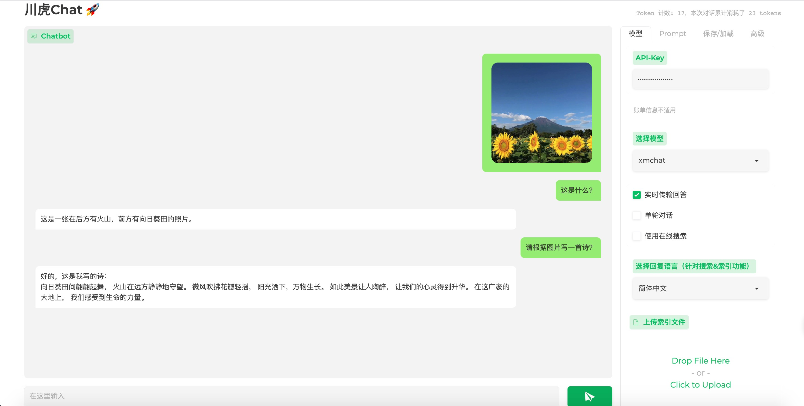

  

# xmchat

Chuanhu-XMChat是由[川虎团队](https://github.com/GaiZhenbiao/ChuanhuChatGPT)和杭电媒体智能实验室[MILVLG团队](https://github.com/MILVLG)联合开发的看图聊天服务。我们通过[ChuanhuChatGPT](https://huggingface.co/spaces/JohnSmith9982/ChuanhuChatGPT)的HuggingFace Space平台来提供xmchat的试玩服务，无需部署，完全免费。

该仓库暂不包含实现代码，目前仅用于收集ISSUE。如果您在体验xmchat的过程中遇到任何问题，欢迎在[ISSUE](https://github.com/MILVLG/xmchat/issues)中进行讨论，当然也可以向我们提出您的意见和建议。

## 使用方法

### 1. 提交申请

请通过[等候列表](https://forms.office.com/r/tvC5pMkw6M)提交试用申请，我们会尽快通过邮件为您提供一个API Key。注意，一个API Key默认只有200次调用次数，请不要将您的API Key泄露给他人。如果需要增加调用次数，请邮件联系[shaozw@hdu.edu.cn](mailto:shaozw@hdu.edu.cn)。

### 2. 打开HuggingFace Space，切换到xmchat模式

打开[ChuanhuChatGPT](https://huggingface.co/spaces/JohnSmith9982/ChuanhuChatGPT)的HuggingFace Space，下拉"选择模型"，选择xmchat模式。在API-KEY处输入我们为您提供的API Key。

### 3. 上传图片，开始聊天

点进"上传索引文件"上传图片，等待图片上传完成后，即可开始聊天。如果您对[ChuanhuChatGPT](https://huggingface.co/spaces/JohnSmith9982/ChuanhuChatGPT)的使用有疑问，或是想体验[ChuanhuChatGPT](https://huggingface.co/spaces/JohnSmith9982/ChuanhuChatGPT)的其他功能，可以参考[视频介绍](https://www.bilibili.com/video/BV1184y1w7aP)。

## 为什么我们选择闭源服务？

我们选择闭源服务的原因有以下几点：

1. 方便大家使用，降低使用门槛，无需复杂的部署流程，也不需要GPU资源。
2. 该项目还处于早期阶段，提供中心化服务使我们可以根据用户反馈更好更快地进行迭代和优化，以提供更好的服务。
3. 我们将收集用户使用数据，用于未来的模型训练和开发 (如果您不希望我们收集您的数据，请在申请时注明)。

不过，xmchat的闭源是暂时的，我们会在适当的时候开源我们的代码。

## 相关项目和鸣谢

xmchat项目基于以下项目进行开发：

- [ChuanhuChatGPT](https://github.com/GaiZhenbiao/ChuanhuChatGPT)
- [Prophet](https://github.com/MILVLG/prophet)

感谢[@GaiZhenbiao](https://github.com/GaiZhenbiao)对本项目的技术支持。
